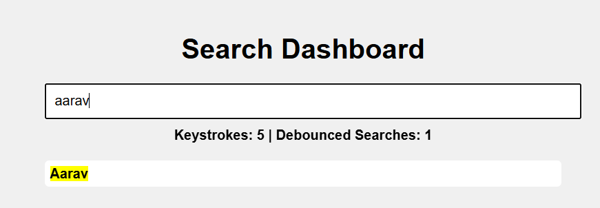

## Search Dashboard App

A web app to search from a large set of names, demonstrating debouncing, throttling, and DOM optimization.

## Features

- Large List Search: Search from 200+ names with real-time results.
- Debounced Search: Input is debounced (1s delay) to optimize performance.
- Scroll Listener with Throttle: "Back to Top" button appears after scrolling 200px, using throttling (500ms) for scroll events.
- Typing Stats Counter: Live counters for total keystrokes and debounced search count.
- UI Highlights: Matching name parts are highlighted.
- Bonus: Loader during debounce delay, and "No results found" message.

## Getting Started

1. Clone the repository.
2. Open Student Record Manager Folder.
3. Open index.html in your browser.

## Demo

- Live App: [Netlify Link](https://search-dashboard-project.netlify.app/)

## Implementation Details

- Debouncing: Limits search function calls while typing.
- Throttling: Reduces scroll event handler frequency.
- DOM Manipulation: Efficient updates for search results and UI elements.

## Screenshots

## Learnings

- Debouncing and throttling for optimized UI.
- Real-time DOM updates and event handling.